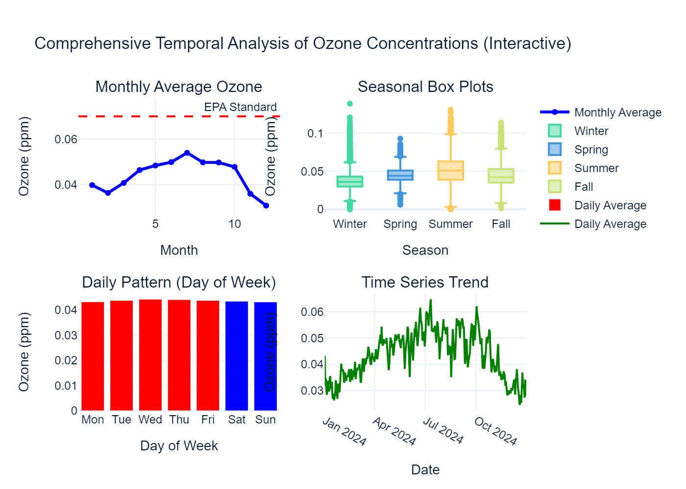

# Ozone-Data-Cleaning-and-Analysis
This repository cointains the data cleaning, EDA, Temporal and timeseries analysis of ozone concentration data of california's Ozone Data to observe it's air quality.
** Temporal Analysis: Seasonal and Monthly Ozone Pattern**

